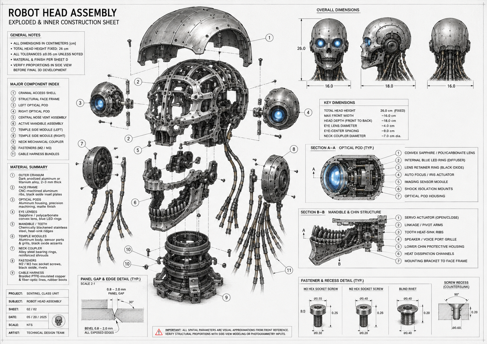
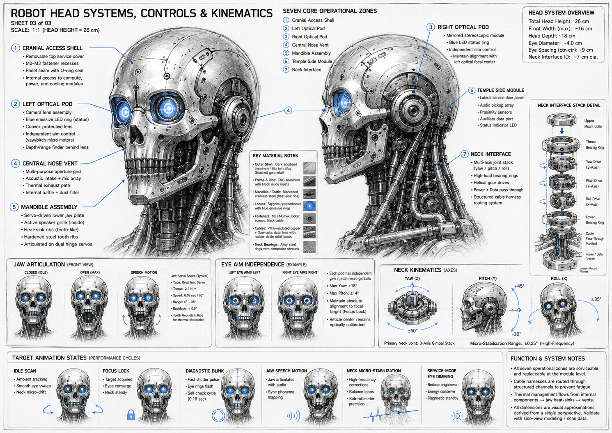
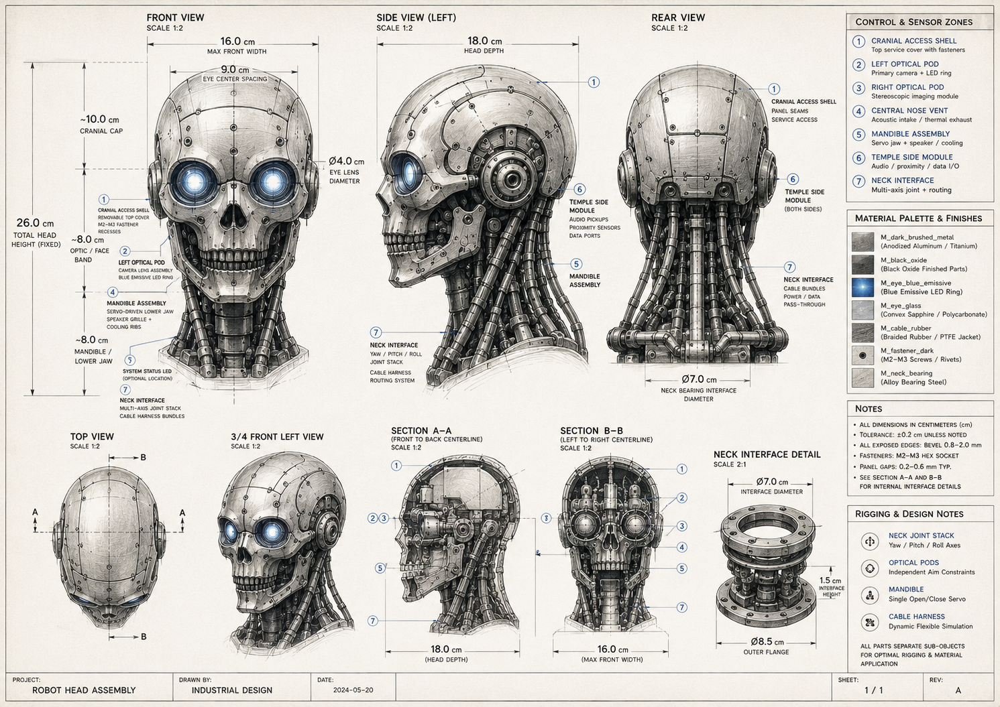

# Robot Head Assembly — Mechanical Documentation

**Document type:** Markdown technical specification  
**Source basis:** Three supplied mechanical/concept sheets:
* **Sheet 1: Orthographic Assembly** (`assets/head/HeadSpec1.png`)
* **Sheet 2: Controls / Kinematics** (`assets/head/HeadSpec2.png`)
* **Sheet 3: Exploded Inner-Construction** (`assets/head/HeadSpec3.png`)
**Unit policy:** Source drawings are in centimeters. This document uses **millimeters as the primary CAD/manufacturing unit**, with source centimeter values shown where useful.  
**Document status:** High-fidelity mechanical design documentation for 3D modeling, rigging, animation, and engineering handoff. It is **not a certified manufacturing drawing** until final CAD, exact datums, exact radii, GD&T, and prototype measurements are produced.

---

## 1. Executive Mechanical Summary

The design describes a **26 cm humanoid robotic skull/head module** with a skeletal-industrial aesthetic. It combines an anodized segmented cranial shell, exposed structural face frame, independent optical pods, central vent/sensor nose cavity, active mandible, circular temple-side modules, cable-bundle neck pass-throughs, and a multi-axis neck interface.

The most important confirmed dimensional envelope is:

| Parameter | Source value | CAD value | Status |
|---|---:|---:|---|
| Total head height | 26.0 cm | 260 mm | Confirmed across sheets |
| Max front width | ~16.0 cm | ~160 mm | Confirmed across sheets |
| Head depth, front to back | ~18.0 cm | ~180 mm | Confirmed across sheets |
| Eye lens diameter | Ø4.0 cm | Ø40 mm | Confirmed across sheets |
| Eye-center spacing | ~9.0 cm | ~90 mm | Confirmed across sheets |
| Neck interface inner diameter | Ø7.0 cm | Ø70 mm | Confirmed across sheets |
| Neck outer flange diameter | Ø8.5 cm | Ø85 mm | Confirmed on neck detail |
| Neck interface visible height | 1.5 cm | 15 mm | Confirmed on neck detail |
| Cranial cap vertical zone | ~10.0 cm | ~100 mm | Confirmed on front view |
| Optic / face band vertical zone | ~8.0 cm | ~80 mm | Confirmed on front view |
| Mandible / lower-jaw zone | ~8.0 cm | ~80 mm | Confirmed on front view |

The head should be modeled as a **multi-object assembly**, not as a single sculpted mesh. The seven main operational zones must remain separate for materials, rigging, inspection, and future animation:

1. Cranial access shell
2. Left optical pod
3. Right optical pod
4. Central nose vent
5. Mandible assembly
6. Temple side modules
7. Neck interface

---

## 2. Cross-Sheet Verification and Reconciliation

### 2.1 Confirmed consistent values

The following values appear consistent across the orthographic, controls/kinematics, and exploded sheets:

- **Head height:** 260 mm.
- **Front width:** approximately 160 mm.
- **Depth:** approximately 180 mm.
- **Eye lens diameter:** Ø40 mm.
- **Eye center spacing:** approximately 90 mm.
- **Neck interface:** Ø70 mm internal/interface diameter.
- **Primary material direction:** dark brushed/anodized metal shell, black oxide internal parts, blue emissive eye rings, clear convex lenses, braided rubber/PTFE cable harnesses.

### 2.2 Important conflicts / design-control decisions

The drawings are visually strong but contain some drafting conflicts. The following reconciliation rules should be used for the final mechanical document and CAD build.

| Topic | Drawing conflict | Recommended design-control decision |
|---|---|---|
| Tolerance | Orthographic sheet says **±0.2 cm** unless noted; exploded sheet says **±0.05 cm** unless noted. | Use **±0.5 mm** for CAD-critical mechanical interfaces and **±2.0 mm** only for concept-envelope / visual layout. |
| Panel gaps | Orthographic notes show **0.2–0.6 mm typical**; exploded panel detail shows **0.8–2.0 mm panel gap**. | Use **0.2–0.6 mm** for fine fixed shell seams. Use **0.8–2.0 mm** for removable service covers, 3D print separation, and exposed mechanical panel breaks. |
| Bevels | Exploded detail shows **0.8–2.0 mm bevel**; orthographic notes also indicate exposed-edge bevels. | Use **0.8–1.2 mm** for small external seams, **1.5–2.0 mm** for thick service panels and flange edges. |
| Scale labels | Sheets use 1:1, 1:2, 2:1, and NTS depending on view. | Treat all scale labels as presentation scale only. Use numeric dimensions as authoritative. |
| Sheet/date labels | Dates and sheet numbering differ between drawings. | Treat the supplied sheets as concept-control references, not finalized release drawings. Use this document as the consolidated control spec. |

---

## 3. Datum System for CAD and Rigging

Use a consistent coordinate system before modeling or rigging.

| Datum | Definition | Use |
|---|---|---|
| **Datum A — Center sagittal plane** | Vertical plane dividing left and right halves through the skull centerline. | Mirroring, eye spacing, nose vent, mandible centerline, neck axis. |
| **Datum B — Neck base plane** | Horizontal plane at the lower mount flange of the neck interface. | Vertical height measurement, mounting stack, robot-body interface. |
| **Datum C — Optical center plane** | Transverse plane passing through both eye optical centers. | Eye pod placement, camera alignment, focus lock, face-band construction. |
| **Datum D — Rear service plane** | Approximate rear reference surface through the rear cranial access panel center. | Rear shell panels, cable exit stack, service access clearance. |
| **Datum E — Neck rotary axis** | Vertical axis passing through the center of the Ø70 mm neck interface. | Neck yaw, pitch/roll gimbal stack, cable pass-through routing. |

Recommended CAD orientation:

- **X axis:** left/right; positive X toward robot right.
- **Y axis:** front/back; positive Y forward.
- **Z axis:** vertical; positive Z upward.
- **Origin:** center of neck interface at the lower mount flange plane.

---

## 4. Overall Dimensional Envelope



### 4.1 Bounding box

The head module should fit inside this approximate envelope:

| Axis | Dimension | Notes |
|---|---:|---|
| X — max front width | 160 mm | Main skull/face width excluding extreme cable flex and optional protruding rig handles. |
| Y — depth | 180 mm | Front face to rear cranial shell. Temple modules sit within or near this side envelope. |
| Z — total height | 260 mm | From lower neck/mandible base to top cranial cap. |

### 4.2 Vertical zone breakdown

| Zone | Height | Z-range if base plane = 0 mm | Function |
|---|---:|---:|---|
| Mandible / lower-jaw zone | ~80 mm | 0–80 mm | Lower jaw, chin bracket, lower grille, neck transition. |
| Optical / face band | ~80 mm | 80–160 mm | Eyes, nose vent, cheek structure, upper jaw. |
| Cranial cap | ~100 mm | 160–260 mm | Removable shell, service panels, internal access, upper frame. |

These are visual zones, not hard parting lines. The face frame and cable harnesses cross between zones.

---

## 5. Major Assembly Breakdown



### 5.1 Component index

| ID | Component | Primary function | Material / finish | Separation requirement |
|---:|---|---|---|---|
| 001 | Cranial access shell | Removable top/rear skull cover, service access | Dark anodized aluminum or titanium, brushed | Separate panels with fasteners and seam gaps |
| 002 | Structural face frame | Internal skull load path and mounting skeleton | CNC-machined aluminum ribs, black oxide inserts | Separate from shell; visible through openings |
| 003 | Left optical pod | Primary camera/lens/LED module | Machined aluminum housing, sapphire/polycarbonate lens | Independently aimable pod |
| 004 | Right optical pod | Stereo/depth imaging module | Same as left pod | Independently aimable pod, mirrored but not identical in role |
| 005 | Central nose vent assembly | Acoustic intake, mic array, thermal exhaust, dust baffle | Black oxide internal grille/baffle | Separate insert with internal depth |
| 006 | Active mandible assembly | Servo-driven lower jaw, speech motion, cooling ribs | Blackened stainless mandible / teeth, aluminum brackets | Hinged, rigged, open/close range |
| 007 | Temple side module, left | Audio pickup, proximity sensors, auxiliary data port | Aluminum circular module with black oxide rings | Separate circular side pod |
| 008 | Temple side module, right | Audio/proximity/data equivalent | Mirrored side module | Separate circular side pod |
| 009 | Neck mechanical coupler | Yaw/pitch/roll joint stack, load transfer | Alloy steel bearing rings, reinforced shrouds | Separate stack; must align to Datum E |
| 010 | Fasteners | M2/M3 screws, rivets, countersunk details | Dark fastener metal | Separate or instanced geometry |
| 011 | Cable harness bundles | Power/data/fiber/cooling route through neck | Braided PTFE/rubber jacket, copper/fiber lines | Separate flexible simulation curves |

---

## 6. Detailed Component Specifications

## 6.1 Cranial Access Shell

**Role:** External upper cranium shell, service cover, and visual protection layer.

**Confirmed / inferred geometry:**

- Rounded skull cap occupying the top ~100 mm of the 260 mm head height.
- Segmented plates arranged along the skull curvature.
- Visible panel seams continue consistently across front, top, side, and rear views.
- Rear service panel is larger and more rectangular, with fasteners around the perimeter.
- Top access shell uses small M2–M3 fasteners in countersunk or recessed holes.

**Material / finish:**

- Dark brushed metal.
- Anodized aluminum or titanium alloy.
- Suggested shell wall thickness: **2–3 mm** as stated in the exploded material summary.

**Mechanical requirements:**

- Shell should be a removable service skin, not the main structural load path.
- Panel breaks must not intersect the optical pod bearing rings or the temple module mounting collars.
- Use a mild bevel on every external panel edge; 0.8–2.0 mm depending on panel scale.
- Rear access seams must leave space for the cable harness pass-throughs and neck interface.

**Modeling notes:**

- Keep individual shell plates as separate objects or at least separate CAD bodies.
- Place fasteners along curvature using projected curves, not flat-grid placement.
- Avoid perfectly smooth science-fiction surfaces; the reference shows industrial brushed, scratched, imperfect metal.

---

## 6.2 Structural Face Frame

**Role:** Internal load-bearing skeleton for the skull, optical pods, nose vent, mandible, and temple modules.

**Geometry features:**

- Curved rib cage inside the cranium.
- Vertical and diagonal ribs around eye sockets.
- Side ribs connecting temple modules to the skull frame.
- Lower brackets supporting mandible hinges and chin housing.
- Multiple visible black oxide inserts and small mechanical plates.

**Material / finish:**

- CNC aluminum frame ribs.
- Black oxide insert plates.
- Matte, slightly worn machining finish.

**Mechanical requirements:**

- Must carry loads from both optical pod gimbals and temple side modules.
- Must isolate removable shell panels from moving jaw and optical pod assemblies.
- Must provide anchor points for cable clips and strain relief.
- Should include internal cross-bracing visible in exploded view.

**CAD requirements:**

- Build as a separate rigid internal frame.
- Do not merge this frame into the cranial shell.
- Provide mounting bosses for:
  - left/right optical pods,
  - temple modules,
  - nose vent insert,
  - mandible hinge plates,
  - rear service panel supports.

---

## 6.3 Left Optical Pod

**Role:** Primary camera / active optical sensor assembly.

**Confirmed dimensions:**

- Lens diameter: **Ø40 mm**.
- Eye centerline: left eye center is approximately **45 mm** left of Datum A when eye-center spacing is 90 mm.
- Eye lens ring is recessed in a larger mechanical socket.

**Internal section components:**

1. Convex sapphire or polycarbonate lens.
2. Internal blue LED ring / diffuser.
3. Lens retainer ring with dark finish.
4. Auto-focus / iris actuator.
5. Imaging sensor module.
6. Shock isolation mounts.
7. Optical pod housing.

**Material / finish:**

- Machined aluminum housing, matte/dark.
- Clear convex lens.
- Blue emissive LED ring.
- Dark retainer ring and internal black anti-reflective surfaces.

**Kinematic requirements:**

- Independent aim control from the right pod.
- Maximum yaw: approximately **±18°**.
- Maximum pitch: approximately **±14°**.
- Must maintain optical calibration/focus lock relative to the face centerline.

**Clearance requirements:**

- Lens must not collide with brow shell during maximum upward pitch.
- Rear sensor block must not collide with internal face frame during yaw extremes.
- Cable exit from rear of pod must have slack for full gimbal range.

---

## 6.4 Right Optical Pod

**Role:** Mirrored stereoscopic imaging / depth-support module.

**Differences from left pod:**

- Same mechanical envelope and lens diameter.
- Right pod is labeled as a stereoscopic imaging module in the control sheet.
- It should visually mirror the left pod, but the internal sensor detail may differ.

**Kinematic requirements:**

- Independent aim control.
- Same nominal range as left pod: yaw ±18°, pitch ±14°.
- Must preserve optical relationship with left pod; eye-center spacing remains ~90 mm.

**Critical verification:**

- With two Ø40 mm lenses and 90 mm center spacing, the lens outer span is approximately **130 mm**.
- Against a 160 mm head width, this leaves approximately **15 mm per side** to the outer facial boundary before temple protrusions. This is visually tight but feasible and matches the reference style.

---

## 6.5 Central Nose Vent Assembly

**Role:** Multi-purpose central face intake/exhaust/sensor cavity.

**Functional notes from source:**

- Acoustic intake.
- Microphone array.
- Thermal exhaust path.
- Internal baffle and dust filter.

**Geometry requirements:**

- Twin triangular/vertical nostril cavities under the eye bridge.
- Dark internal material; avoid flat black texture only — use real recessed geometry.
- Nose bridge must remain thin but structurally believable.
- Internal baffles should sit behind the visible nostril openings.

**Tricky area:**

This component is visually small but mechanically important. The eye pods, upper jaw frame, and central vent converge in a narrow region. Keep actual voids and frame thicknesses believable:

- Minimum visible web thickness should not look below ~2 mm at this scale.
- Keep nose vent as a separate replaceable insert.
- Avoid letting the mandible hinge geometry intrude into the rear of the vent.

---

## 6.6 Active Mandible Assembly

**Role:** Servo-driven lower jaw for speech motion, grille opening, and thermal dissipation.

**Source notes:**

- Servo-driven lower jaw plate.
- Active speaker grille inside.
- Heat-sink ribs / teeth-like structure.
- Hardened steel tooth ribs.
- Articulated on dual hinge servos.

**Jaw articulation:**

| Parameter | Value |
|---|---:|
| Typical actuator | Brushless servo |
| Torque | ~2.2 N·m |
| Speed | ~0.18 s / 60° |
| Range | 0–38° |
| Backlash | <0.5° |

**Mechanical interpretation:**

- The “teeth” should be treated as **heat-sink ribs / grille fins**, not biological teeth.
- The lower jaw should open around a rear/side dual-hinge axis.
- The lower jaw must clear the upper grille and nose underside when opening.
- Cable harnesses behind the jaw must not intersect the jaw sweep path.

**Estimated clearance from jaw opening:**

If the visible mandible length from hinge to chin/front edge is approximately 65–75 mm, a 38° rotation can create roughly 40–46 mm of chin-edge displacement. Reserve clearance in the neck/cable region accordingly.

---

## 6.7 Temple Side Modules

**Role:** Circular side-mounted audio/proximity/data sensor modules.

**Source notes:**

- Audio pickup array.
- Proximity sensors.
- Auxiliary data port.
- Status indicator LED.
- Lateral service door/panel.

**Geometry requirements:**

- Large circular module centered behind the eye band, approximately at temple height.
- Concentric rings with exposed fasteners.
- Central port / speaker-like circular detail.
- Must be mounted to the structural side frame, not only to the shell.

**Tricky area:**

The temple modules appear to sit at the side of the skull where the cranial shell curvature, optical pods, and rear cable harnesses meet. For CAD:

- Build a recessed side mounting socket first.
- Add the circular temple pod as a separate bolted module.
- Add 4–8 fasteners around the outer ring.
- Keep enough side clearance so the module does not visually float outside the 180 mm depth envelope.

---

## 6.8 Neck Interface and Multi-Axis Joint Stack

**Role:** Mechanical interface between head and body, with yaw/pitch/roll control and cable pass-through.

**Confirmed dimensions:**

| Feature | Dimension |
|---|---:|
| Interface diameter | Ø70 mm |
| Outer flange diameter | Ø85 mm |
| Visible interface height | 15 mm |

**Stack elements shown in source:**

1. Upper mount collar.
2. Thrust bearing ring.
3. Yaw drive, Z-axis.
4. Pitch drive, Y-axis.
5. Roll drive, X-axis.
6. Lower bearing ring.
7. Cable pass-through manifold.
8. Power/data conduit.
9. Lower mount flange.

**Kinematic range:**

| Axis | Range |
|---|---:|
| Yaw Z | ±60° |
| Pitch Y | +45° / -30° |
| Roll X | ±35° |
| Micro-stabilization | ±0.25° high-frequency |

**Mechanical interpretation:**

- The 15 mm neck interface detail is the visible collar/flange height, not the full height of all internal yaw/pitch/roll mechanics.
- The Ø70 mm interface is likely the main pass-through / coupler diameter.
- The Ø85 mm outer flange leaves ~7.5 mm radial flange width per side, which is tight but workable for M2/M3 fasteners if the bolt circle is carefully placed.

**Design requirements:**

- Keep cable pass-through centered on Datum E.
- Route cable bundles outside moving bearing raceways.
- Add flexible strain relief boots where cable bundles exit the manifold.
- Do not let neck yaw twist cables infinitely; use either slip ring detail, service loop, or limited yaw logic.

---

## 6.9 Cable Harness Bundles

**Role:** Dynamic power/data/fiber/cooling lines from head to body.

**Source notes:**

- Braided rubber/PTFE jacket.
- Copper and fiber-optic data lines.
- Rubber strain relief boots.
- Structured cable harness routing system.
- Dynamic flexible simulation required for rigging.

**Modeling requirements:**

- Use multiple cable diameters, not identical tubes.
- Suggested visible cable diameters: **3–6 mm**.
- Use repeated clamp collars or segmented rib sleeves at 8–16 mm intervals.
- Cables should route from rear skull/temple/mandible into the neck pass-through manifold.
- Leave a service loop near the side modules and jaw hinge.

**Rigging requirements:**

- Cable curves should be spline-driven with collision avoidance.
- Anchor points:
  - rear skull exit,
  - temple module lower port,
  - mandible rear bracket,
  - neck manifold collar,
  - lower body receiver.
- Simulated cable motion should be secondary to neck movement, not independently exaggerated.

---

## 7. Fasteners, Recesses, and Panel Edges

### 7.1 Fastener standards visible in sketches

| Fastener | Source dimension interpretation | CAD dimension |
|---|---:|---:|
| M3 hex socket screw head diameter | Ø0.55 cm | Ø5.5 mm |
| M3 screw height/head stack | 0.25 cm | 2.5 mm |
| M3 thread/shaft diameter | Ø0.30 cm | Ø3.0 mm |
| M2 hex socket screw head diameter | Ø0.40 cm | Ø4.0 mm |
| M2 screw height/head stack | 0.26 cm | 2.6 mm |
| M2 thread/shaft diameter | Ø0.20 cm | Ø2.0 mm |
| Blind rivet diameter | Ø0.40 cm | Ø4.0 mm |
| Blind rivet height | 0.20 cm | 2.0 mm |
| Countersunk recess angle | 90° | 90° |
| Countersunk recess outer diameter | Ø0.60 cm | Ø6.0 mm |
| Countersunk recess depth | 0.20 cm | 2.0 mm |

### 7.2 Placement rules

- Use M2 fasteners on small cranial panels, optical retainer details, and light service covers.
- Use M3 fasteners on neck flange, temple side module rings, larger shell covers, and major structural brackets.
- Avoid perfectly repeated decorative screws. The design should feel engineered, so fasteners must align with panel seams, flanges, and service logic.
- Use black/dark fastener material for contrast against brushed metal.

### 7.3 Panel edges

| Edge type | Recommended treatment |
|---|---|
| Fine fixed shell seam | 0.2–0.6 mm gap; 0.4–0.8 mm bevel |
| Removable access cover | 0.8–1.2 mm gap; 0.8–1.5 mm bevel |
| Large exploded-service panel | 1.2–2.0 mm gap; 1.5–2.0 mm bevel |
| Optical pod retainer edge | Small bevel; concentric machined groove |
| Neck flange edge | Strong bevel/chamfer; visible bolt recesses |

---

## 8. Materials and Finish Palette

| Material code | Description | Intended parts | Finish notes |
|---|---|---|---|
| `M_dark_brushed_metal` | Dark anodized aluminum / titanium | Cranial shell, large outer panels | Brushed, scratched, slightly worn |
| `M_black_oxide` | Black oxide finished metal | Internal brackets, retainer rings, mandible plates | Low-reflection, dark mechanical surfaces |
| `M_eye_blue_emissive` | Blue emissive LED material | Eye rings, small status lights | Use glow/bloom only on LED geometry |
| `M_eye_glass` | Convex sapphire / polycarbonate | Eye lens covers | Transparent, slight blue refraction |
| `M_cable_rubber` | Braided rubber / PTFE jacket | Cable harnesses | Ribbed, flexible, black/dark gray |
| `M_fastener_dark` | Dark screw/rivet material | M2/M3 screws, rivets | Slight edge wear on heads |
| `M_neck_bearing` | Alloy bearing steel | Neck bearing rings and thrust races | Polished contact surfaces, darker housings |
| `M_internal_aluminum` | CNC aluminum structural ribs | Face frame, skull rib cage | Machined, worn edges |
| `M_heat_sink_blackened_steel` | Chemically blackened stainless | Mandible teeth/ribs | Looks like cooling fins, not natural teeth |

---

## 9. Optical System Requirements

### 9.1 Eye spacing and pod layout

- Eye center spacing: **90 mm**.
- Lens diameter: **40 mm**.
- Lens edge-to-edge gap: **approximately 50 mm**.
- Outer lens span: **approximately 130 mm**.
- Remaining lateral space to a 160 mm face width: **approximately 15 mm per side**, before side cheek/temple protrusions.

This confirms the design intentionally uses large optical pods with tight side clearances. The face frame must be precise around the eye sockets.

### 9.2 Lens stack

Recommended front-to-back stack:

1. Convex clear protective lens.
2. Front retainer ring.
3. Blue emissive LED diffuser ring.
4. Inner anti-reflective barrel.
5. Camera/sensor block.
6. Micro-gimbal or actuator housing.
7. Rear cable and shock-isolation plate.

### 9.3 Rigging rules

- Each pod gets its own local pivot centered near the lens optical axis.
- Do not pivot the whole eye from a point behind the skull; it will look incorrect.
- LED ring should remain concentric with the lens during aiming.
- The rear sensor body may move slightly inside the socket, but it must never clip through the frame.

---

## 10. Neck and Head Kinematics



### 10.1 Primary neck motion

| Motion | Axis | Range | Design notes |
|---|---|---:|---|
| Yaw | Z | ±60° | Main left/right head turn. Cable twist must be constrained. |
| Pitch | Y | +45° / -30° | Up/down tilt. Rear shell and cable bundles need clearance. |
| Roll | X | ±35° | Side tilt. Check temple modules against shoulders/body. |
| Micro-stabilization | multi-axis | ±0.25° | High-frequency small correction only. |

### 10.2 Eye motion

| Motion | Range | Notes |
|---|---:|---|
| Eye yaw | ±18° | Independent left/right aim. |
| Eye pitch | ±14° | Independent vertical aim. |
| Focus lock | n/a | Reticle center must remain calibrated. |

### 10.3 Mandible motion

| State | Description |
|---|---|
| Closed / idle | Teeth/heat-sink fins form a compact grille; no lower gap. |
| Open maximum | Lower jaw opens to ~38°. Avoid cable and neck collision. |
| Speech motion | Small repeated jaw motion synchronized to audio/phoneme mapping. |

---

## 11. Animation / Operational States

The control sheet identifies six target performance cycles. These should be implemented as named animation presets.

| State | Mechanical behavior | Visual behavior |
|---|---|---|
| Idle Scan | Smooth eye sweep, neck micro-drift | Soft blue eye glow, minimal jaw movement |
| Focus Lock | Eyes converge, neck steadies | Target-acquired posture, reduced random motion |
| Diagnostic Blink | Fast shutter pulse / iris flash | Eye rings flash, 0.18 s self-check cycle |
| Jaw Speech Motion | Jaw articulates with audio | Speaker grille visible; phoneme mapping drives lower jaw |
| Neck Micro-Stabilization | High-frequency correction | Very small balancing movements only |
| Service-Mode Eye Dimming | Reduce eye brightness | Diagnostic standby, calmer expression |

---

## 12. Assembly Sequence

### 12.1 Recommended assembly order

1. **Build neck coupler base**
   - Lower mount flange.
   - Cable pass-through manifold.
   - Bearing rings and yaw/pitch/roll drive housings.

2. **Install structural face frame**
   - Attach skull rib cage to neck upper collar.
   - Confirm Datum A centerline and Datum E neck axis alignment.

3. **Install mandible hinges and jaw**
   - Mount dual side hinge brackets.
   - Install lower jaw/mandible plate.
   - Check open/close clearance before adding front shell details.

4. **Install central nose vent**
   - Insert internal baffle/dust filter.
   - Add mic-array details and thermal exhaust channel.

5. **Install optical pods**
   - Mount left/right gimbal sockets.
   - Add pod housings, lenses, LED rings, rear sensor blocks.
   - Verify eye-center spacing and aim range.

6. **Install temple side modules**
   - Mount circular side modules to structural frame.
   - Connect audio/proximity/data detail lines.

7. **Route cable harnesses**
   - Add cable bundle anchors and collars.
   - Route into neck pass-through manifold.
   - Add flexible service loops.

8. **Install cranial shell panels**
   - Add shell plates from rear/top outward.
   - Add panel seams, fasteners, countersinks, and rear service cover.

9. **Final rig and collision check**
   - Neck yaw/pitch/roll.
   - Eye pod yaw/pitch.
   - Jaw open/close.
   - Cable flex and no-clipping validation.

---

## 13. Zoom-In Audit of Tricky Areas

### 13.1 Eye pod and face-frame intersection

**Risk:** The large Ø40 mm lenses occupy most of the 160 mm front width. The eye pods sit close to the cheek frame and brow shell.

**Verification decision:** Use the confirmed 90 mm eye spacing and Ø40 mm lens diameter as hard constraints. Build the eye sockets around these first, then fit shell panels around them.

**Required checks:**

- Lens ring concentricity.
- Gimbal pivot inside socket.
- No collision with brow at +14° pitch.
- No collision with nose bridge at inward yaw.

### 13.2 Nose bridge and central vent

**Risk:** The nose vent is visually narrow, but it must contain acoustic intake, mic array, thermal exhaust, baffle, and filter details.

**Verification decision:** Treat it as a separate insert with real depth. Use dark internal material and visible inner baffles.

**Required checks:**

- Minimum visible web thickness.
- Clearance from pod housings.
- Clearance from upper mandible structure.

### 13.3 Mandible hinge and teeth/heat-sink ribs

**Risk:** The teeth-like ribs can look decorative if not tied to the mechanical jaw.

**Verification decision:** Model teeth as blackened heat-sink/speaker-grille fins integrated into the mandible shell. Keep the jaw pivot physically readable.

**Required checks:**

- 38° max opening.
- Less than 0.5° backlash in animation curves.
- No cable intersection behind jaw.
- Speaker grille remains visible inside mouth opening.

### 13.4 Temple side modules

**Risk:** Side modules are large circular protrusions and can easily look pasted onto the skull.

**Verification decision:** Cut recessed circular sockets into the structural side frame and cranial shell. Bolt the module through a real ring flange.

**Required checks:**

- Concentric fastener pattern.
- Service-door seam.
- Cable/data port exists below or behind the circular module.
- Mirror both sides, but preserve role differences if the right side is a stereo module.

### 13.5 Neck interface stack

**Risk:** The neck detail shows a small 15 mm flange but the kinematics show a much larger multi-axis stack.

**Verification decision:** Interpret the 15 mm value as the visible interface collar height. The full neck mechanism may extend below the head into the robot torso.

**Required checks:**

- Ø70 mm pass-through remains clear.
- Ø85 mm outer flange holds M2/M3 fasteners without edge break-out.
- Yaw/pitch/roll axes are physically separated.
- Cable twist is mechanically constrained.

### 13.6 Cable harness density

**Risk:** Rear cables may become visually noisy or intersect the neck stack.

**Verification decision:** Organize cables into left, right, central, and rear bundles. Use anchors and collars so they look intentionally routed.

**Required checks:**

- No cables intersect rotating neck parts.
- Cable loops flex during pitch and roll.
- Bundle thickness varies naturally.
- Cables enter the pass-through manifold, not random shell holes.

---

## 14. CAD Modeling Guidelines

### 14.1 Recommended object naming

Use a consistent prefix for all objects:

```text
RH_001_CranialAccessShell_PanelTop_A
RH_001_CranialAccessShell_PanelRear_ServiceCover
RH_002_StructuralFaceFrame_RibBrow_L
RH_003_LeftOpticalPod_Lens
RH_003_LeftOpticalPod_LED_Ring
RH_004_RightOpticalPod_SensorBlock
RH_005_CentralNoseVent_Baffle
RH_006_Mandible_JawPlate
RH_006_Mandible_HeatSinkTeeth
RH_007_TempleSideModule_L
RH_008_TempleSideModule_R
RH_009_NeckCoupler_YawRing
RH_011_CableHarness_RearBundle_A
```

### 14.2 Modeling priorities

1. Lock the **260 × 160 × 180 mm** bounding envelope.
2. Place neck interface Ø70/Ø85 mm at the origin.
3. Place eye centers 90 mm apart.
4. Model structural frame before shell plates.
5. Add optical pod sockets before lenses and LED rings.
6. Add mandible hinges before cosmetic teeth/ribs.
7. Add cable harnesses last, after moving-part clearances are checked.

### 14.3 Geometry style

- Use hard-surface bevels, not soft organic sculpting.
- Keep exposed interiors dense and layered.
- Use real thickness on shell panels and ribs.
- Use countersunk or recessed screw heads rather than flat circles.
- Use asymmetrical wear/scratches only in material/texturing, not in base geometry.

---

## 15. Rigging Guidelines

### 15.1 Rig hierarchy

```text
Head_Root
 ├─ Neck_Base
 │   ├─ Neck_Yaw_Z
 │   │   ├─ Neck_Pitch_Y
 │   │   │   ├─ Neck_Roll_X
 │   │   │   │   └─ Skull_Frame
 │   │   │   │       ├─ Cranial_Shell
 │   │   │   │       ├─ OpticalPod_L_Aim
 │   │   │   │       ├─ OpticalPod_R_Aim
 │   │   │   │       ├─ NoseVent_Static
 │   │   │   │       ├─ Mandible_OpenClose
 │   │   │   │       ├─ TempleModule_L_Static
 │   │   │   │       ├─ TempleModule_R_Static
 │   │   │   │       └─ CableHarness_Dynamic
```

### 15.2 Rig constraints

| System | Constraint |
|---|---|
| Left eye | yaw ±18°, pitch ±14° |
| Right eye | yaw ±18°, pitch ±14° |
| Mandible | rotate 0–38° only |
| Neck yaw | ±60° |
| Neck pitch | +45° / -30° |
| Neck roll | ±35° |
| Cable harness | follows neck with delayed/smoothed secondary motion |

---

## 16. Quality-Control Checklist

### 16.1 Dimensional checks

- [ ] Total height is 260 mm.
- [ ] Front width is approximately 160 mm.
- [ ] Depth is approximately 180 mm.
- [ ] Eye lens diameter is Ø40 mm.
- [ ] Eye centers are 90 mm apart.
- [ ] Neck interface is Ø70 mm internal / interface diameter.
- [ ] Neck outer flange is Ø85 mm.
- [ ] Neck visible collar height is 15 mm.
- [ ] Cranial cap occupies roughly 100 mm of vertical height.
- [ ] Face/optic band occupies roughly 80 mm.
- [ ] Mandible/lower-jaw zone occupies roughly 80 mm.

### 16.2 Mechanical checks

- [ ] Cranial shell is removable / panelized.
- [ ] Structural frame is a separate load-bearing assembly.
- [ ] Optical pods are independent and aimable.
- [ ] Nose vent has actual depth and internal baffle geometry.
- [ ] Mandible pivots from real hinge brackets.
- [ ] Temple modules are socketed into side frame.
- [ ] Neck joint stack has readable yaw/pitch/roll separation.
- [ ] Cables route through a controlled pass-through manifold.

### 16.3 Material checks

- [ ] Shell uses dark brushed/anodized metal.
- [ ] Internal brackets use black oxide finish.
- [ ] Eye rings are blue emissive only on light elements.
- [ ] Eye lenses are transparent convex glass/polycarbonate.
- [ ] Cable harnesses use braided rubber/PTFE finish.
- [ ] Fasteners are dark metal and scale-appropriate.
- [ ] Neck bearings use darker housing with polished bearing surfaces.

### 16.4 Rigging checks

- [ ] Neck yaw can reach ±60° without cable over-twist.
- [ ] Neck pitch reaches +45° and -30° without rear collision.
- [ ] Neck roll reaches ±35° without temple/body collision.
- [ ] Eye pods reach ±18° yaw and ±14° pitch.
- [ ] Jaw opens to 38° without clipping the neck or cable bundles.
- [ ] Cable harnesses have secondary motion and collision limits.

---

## 17. Final Design-Control Notes

1. **Use the numbers, not the printed drawing scale.** The sheets mix 1:1, 1:2, 2:1, and NTS views. The numeric dimensions are the reliable source.
2. **Model it as an assembly.** The design will lose mechanical credibility if shell, frame, lenses, jaw, side modules, and cables are fused into one mesh.
3. **Resolve tolerance conflicts by context.** Use tight tolerance for mechanical interfaces and looser tolerance for visual concept areas.
4. **Preserve the industrial service logic.** Screws, panel seams, cable routing, removable covers, and access shells must feel functional.
5. **Avoid biological skull interpretation.** The silhouette is skull-inspired, but the teeth, eyes, and nose are mechanical modules: heat sinks, camera pods, vents, grilles, and sensors.
6. **Prioritize the optical pods and neck interface.** These are the most mechanically constrained and visually important systems.

---

## 18. Recommended Next-Step Deliverables

For a production-ready handoff, create these follow-up assets:

1. **Clean orthographic CAD blockout** using the 260 × 160 × 180 mm envelope.
2. **Exploded part list** with every shell panel and service cover named.
3. **Rig-ready mechanical hierarchy** for neck, eyes, jaw, and cable bundles.
4. **Collision envelope drawings** for jaw, eye pods, and neck motion.
5. **Material ID map** matching the material codes in this document.
6. **Fastener placement map** for cranial shell, temple modules, optical pods, and neck flange.
7. **Cable routing diagram** showing anchor points, dynamic sections, and pass-through manifold.

